- ## 第三次实验报告

  #### 课程设计

  ##### 主要内容

  - 图像编辑器

    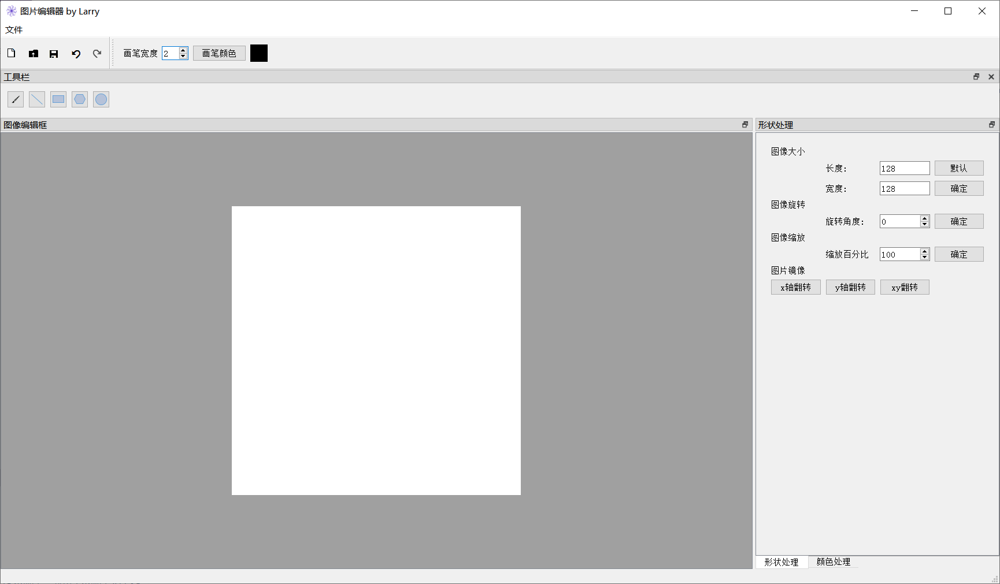

  - 主要实现的功能:

    - 新建,打开本机的图片(jpg,png,bmp),保存修改,另存为本机图片(jpg,png,bmp),可以通过另存为来修改原图的格式

      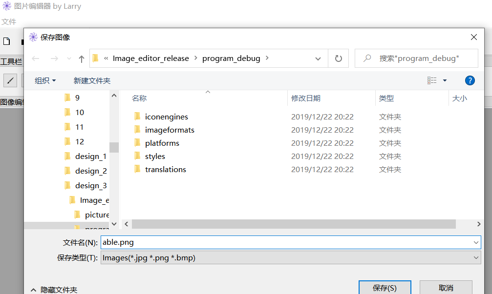

    - 多种画笔,并且可以选颜色,笔宽:

      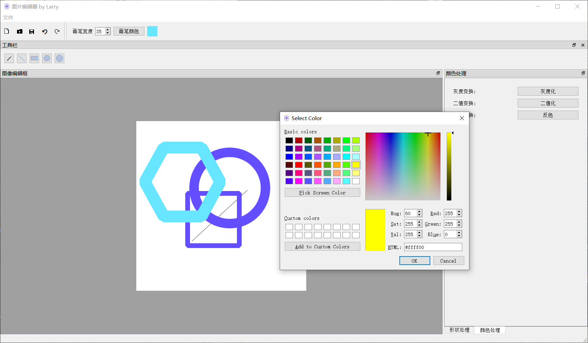

    - 撤销,重做功能: 可以通过撤销按钮/快捷键回到上一次保存的版本;

      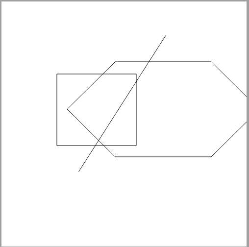

      

    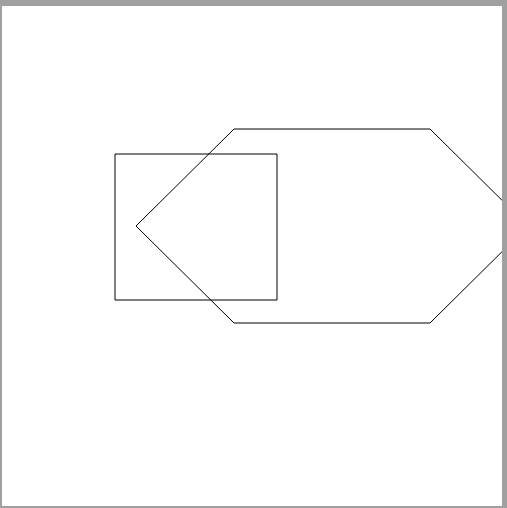

  - 图片形态的一些功能,包括指定图片大小,图片缩放,图像旋转,图像x,y,xy轴对称的操作,并且可以通过默认键直接让图片缩放到自适应窗口的大小;

    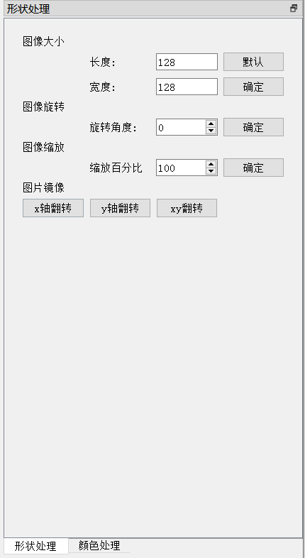

  - 图片的颜色的宏观的一些处理,包括灰度化,二值化,色彩反转;

    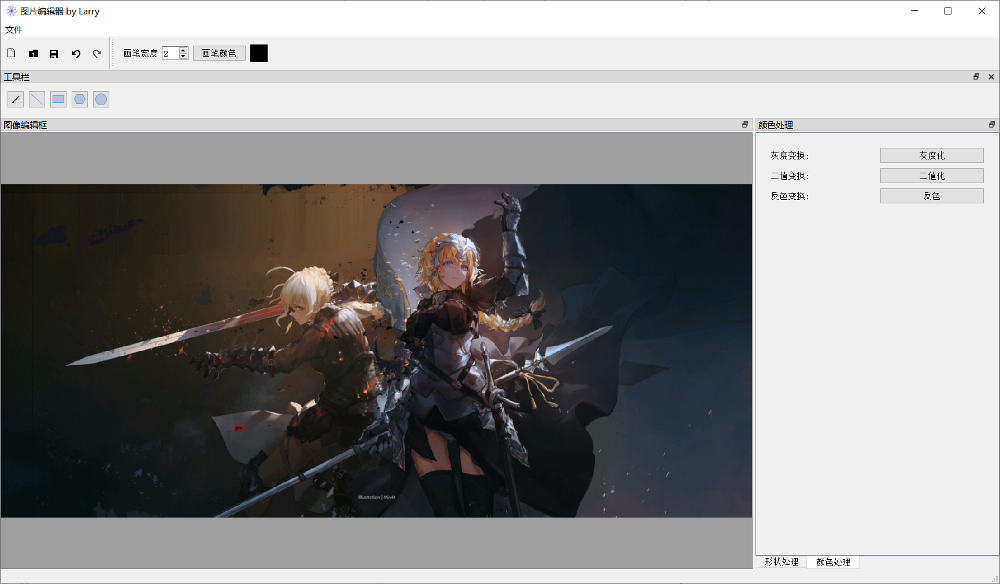

    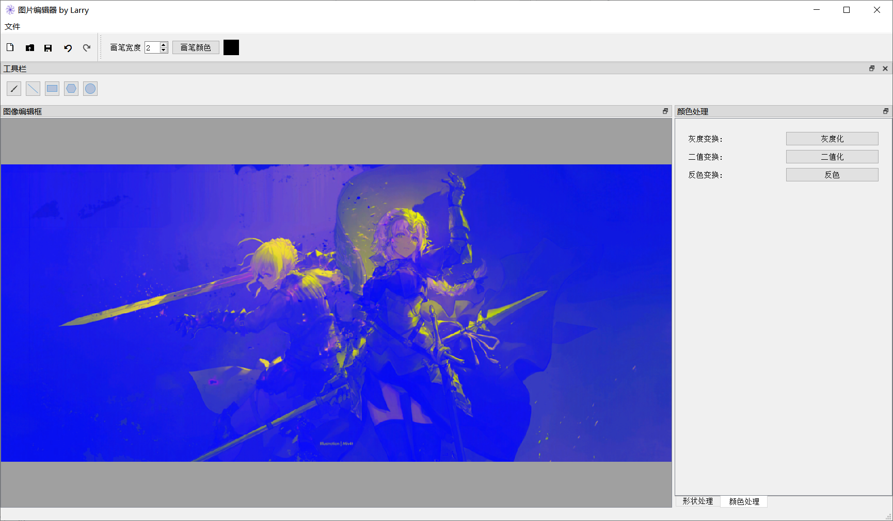

    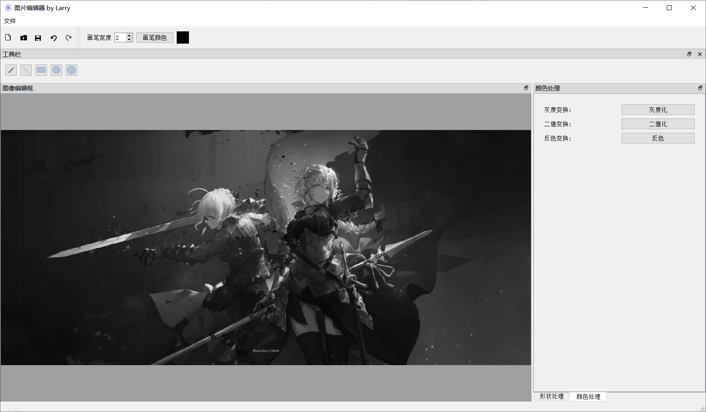

    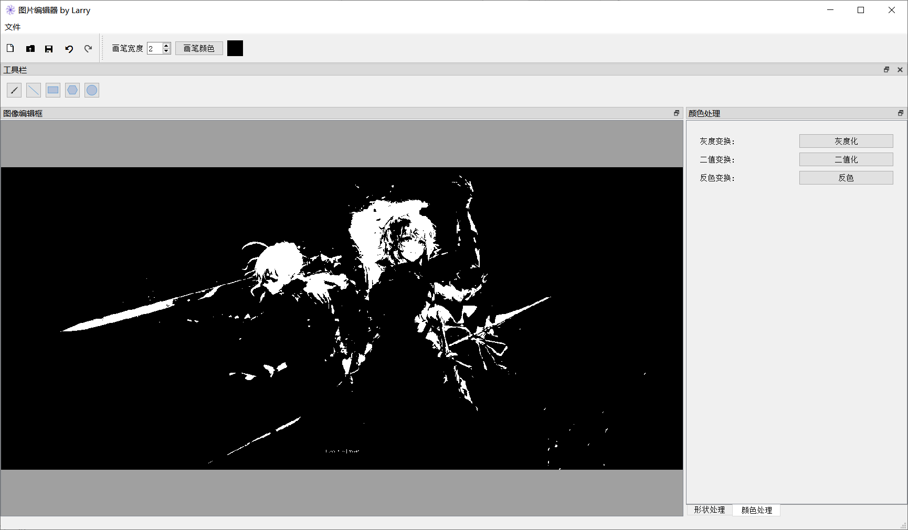

  - 程序的编写环境：

    Qt 5.12.6 MSCV2017 64bit+opencv 4.12+Qt creater

    封装是通过脚本：

    ````
    F:\QT\5.12.6\msvc2017_64\bin\windeployqt.exe image_editor.exe
    pause
    ````

    我在交的可执行程序包里面附带了opencv的dll文件以及一些可能缺失的文件,在多名同学的电脑上都能够运行,在没有装任何C语言环境的电脑上可能会缺失MSCVP140D.dll;

  #### 课程设计目标

  - 我一开始的想法是做一个png,jpg的图片格式转换工具,后来感觉过于简朴了,加上用画图编辑表情包有时候缺少一定的功能,比如灰度化,二值化,就想做一个类似于画图的图片编辑器;大概效果如上;
  - 我个人的目标是通过这次课程设计学会GUI的一些编程以及初步掌握Qt，通过这次课设我也确实查阅了很多资料，虽然花了很多时间（我自学了大概2天，然后断断续续写了3天再加一整个周末），但是基本完成了目标。

  #### 设计思路

  - 主要的文件如下:

    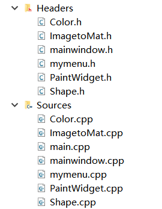

    其中mymenu.cpp,mymenu.h是废弃的文件,忽略不谈;

  - 主要的文件关系：

    ```mermaid
    graph LR
    A[ImagetoMat]-->B[Color]
    A-->C[Shape]
    D[PaintWidget]-->E[mainwindow]
    B-->E
    C-->E
    E-->F[main]
    ```

  - 因为Qt编程实际上是一个个模块化的编程实现,我的大概思路就是,在mainwindow中首先进行大体的布局,包括画布,菜单栏,工具栏,功能窗口等,然后通过实现一个个功能性的类,通过槽函数调用这些功能,通过connect讲功能和按钮联系在一起;

  - Color,Shape,ImagetoMat 都是提供功能的类:

    - ImagetoMat 提供了QImage 到 opencv 的Mat格式之间的相互转换的功能
    - Color 提供了 灰度化,二值化,色彩反转 的基于opencv的函数
    - Shape 提供了 指定图片大小,图片缩放,图像旋转,图像x,y,xy轴对称的基于opencv的函数

  - PaintWidget 实现了继承了父类型 QLabel的一个PaintWidget类:

    ````c+
    class PaintWidget :public QLabel
    {
        Q_OBJECT
    public:
        explicit PaintWidget(QWidget *parent = nullptr);
        enum shape {
            Pen = 1,Line=2,Rec=3,Hex=4,Cycle=5,tobedone,null_state
        };
        void paint(QImage &theImage);
        void setImage(QImage img);
        QImage getImage(); // 外部获取图像
    
        void setShape(PaintWidget::shape );                     // 设置绘制类型
        void setPenWidth(int w);                                // 设置画笔宽度
        void setPenColor(QColor c);                             // 设置画笔颜色
    
    protected:
        void paintEvent(QPaintEvent *);
        void mousePressEvent(QMouseEvent *);
        void mouseMoveEvent(QMouseEvent *);
        void mouseReleaseEvent(QMouseEvent *);
    
    private:
        PaintWidget::shape type;
        int penWidth;
        QColor penColor;
        QImage image;
        QImage tempImage;
        QPoint lastPoint;
        QPoint endPoint;
        bool isDrawing;
    };
    
    ````

    ​	主要是为了实现双缓冲绘图机制

  - 最主要的部分在mainwindow中,mainwindow类中负责了所有的布局,控件以及槽函数:

    ````c+
    class MainWindow : public QMainWindow
    {
        Q_OBJECT
    
    public:
        MainWindow(QWidget *parent = nullptr);
        ~MainWindow();
        void helloworld();
    
    private:
        Ui::MainWindow *ui;
        QDockWidget *Image_window;//图像浮动窗口
        QDockWidget *Color_window;//颜色总体的设置 包括灰度化等
        QDockWidget *Shape_window;//形状处理;
    
        //目录中的变量;
        QAction *afile_undo;//撤销;
        QAction *afile_redo;//恢复;
    
        QDockWidget *Tool_window;//工具栏
        QScrollArea * scrollArea;//滚动条
    
        //Tool 中的变量
        int tooltype;
        QButtonGroup *toolbuttons;//tool 按钮组
    
        //Color Tools
        QToolBar * Color_bar;
        QSpinBox *spinbox_penWidth;
        QFrame *frame_color;
    
        //形状处理里面的变量
        QLineEdit *size_L, *size_W;
        QSpinBox *spinbox_rotateangles;
        QSpinBox *spinbox_scaletimes;
    
        std::vector<std::vector<QImage>> Image_vector;//图片vector 用来实现redo undo功能
        std::vector<QImage>::iterator Image_iter;//迭代器
    
    
        QString Image_path;// 当前图片的路径
       // QLabel* Image_label;// 图像显示框
        PaintWidget * Image_label;
    
        void init();
        void layout_init();//窗口布局初始化
        void Menu_init();//初始化菜单
        void Tool_init();//初始化工具栏
        void Image_init();//初始化图像窗口
        void Color_init();//初始化颜色/线宽栏;
        void Shape_init();//形状调整窗口初始化
        void Colorchange_init();//颜色调整窗口初始化
        void Image_show(QImage Img, bool isSave);//显示图像
        void undo();
        void redo();
    private slots:
        void iSlot();
        void file_new();
        void file_open();
        void file_save();
        void file_saveas();
        void file_undo();
        void file_redo();
        void tool_clicked(int type);
        void pen_width();//画笔宽度;
        void pen_color();//设置画笔的颜色
        void size_auto();//适应窗口大小
        void size_change();//改变图片大小
        void picture_rotate();//旋转一定角度， 根据spinbox_rotateangles里面的值
        void picture_scale();//图像缩放一定的倍数,值shi spinbox_caletims/100;
        void flip_x();
        void flip_y();
        void flip_xy();//镜像
        void Color_gray();//灰度化;
        void Color_binary();//二值化;
        void Color_reversal();//颜色反转;
    
    };
    ````

  - 我主要讲一下我觉得很有意思的redo,undo功能,这个功能的实现主要是通过维护在mainwindow.h的MainWindow类中定义的Image_vector以及相应的迭代器来实现的,每一次保存以及进行图像的形状,颜色操作的时候都会调用Image_show函数,在这个函数里面会根据传进去的isSave维护Image_iter,保证在Image_show且isSave==true的时候,Image_iter指向vector的最后面一个图片,然后再push_back最新的图片;然后在undo的时候迭代器前移,在redo的时候迭代器后移(当然会保证它们不越界);这样子相当于把图片的历史记录在了vector里面,并且是可以恢复的;

  - 其他的功能因为要期末复习的原因我就不细说了;

  #### 遇到的困难以及解决方法

  1. opencv+Qt的环境配置一开始上手真的很困难,很多网上的教程都是过时的或者是错误的,基本得通过多次试错并且查看国外网站的回答才能够最终找到正确的方法:

     1. 下载opencv 4.12 的windows版本,这是一个可以自己解压到某一个地方的文件

     2. 添加opencv的vc15/bin的路径到系统环境变量里面,我的是

        ````
        F:\opencv\build\x64\vc15\bin
        ````

        添加Qt的bin,我的是

        ````
        F:\QT\5.12.6\msvc2017_64\bin
        F:\QT\Tools\QtCreator\bin
        ````

     3. VS2017的配置可以参考[网站](https://blog.csdn.net/weixin_39393712/article/details/79583274),主要是一些手动添加

        Qtcreater的是右击项目-->添加库-->外部库 然后加入opencv文件夹里面的一个opencv_world412.dll动态库,我的地址是:

        ````
        F:\opencv\build\x64\vc15\bin
        ````

        然后在.pro文件下面加一些include的地址,我的是:

        ````
        INCLUDEPATH+=F:/opencv/build/include
        INCLUDEPATH+=F:/opencv/build/include/opencv2
        ````

        然后可以通过以下代码测试：

        ````
        #include "opencv2/opencv.hpp"
        #include <iostream>
        
        using namespace cv;
        
        #define WAITKEY_DELAY 30
        #define CAMERA_DEVICE 0
        
        int main(void)
        {
            VideoCapture captureDevice(CAMERA_DEVICE);
            if (!captureDevice.isOpened())
                return -1;
        
            Mat edges;
            namedWindow("edges", 1);
            for (;;)
            {
                Mat frame;
                captureDevice >> frame;
                cvtColor(frame, edges, COLOR_BGR2GRAY);
                imshow("edges", edges);
                auto key = waitKey(WAITKEY_DELAY);
                if (key >= 0)
                    break;
            }
        }
        
        
        ````

        效果是打开摄像头

  2. 在写项目的过程中遇到的比较多的bug是SIGAL或者SLOT里面的函数笔误造成的,因为Qt的某种特性,这些函数的报错只会在输出栏里面看到

  3. 在项目快发布的时候我发现了一个问题,就是灰度处理之后不能再用画笔在上面画画了,当时的报错我记得是QPainter不能再Format_Indexed8上面画画；经过研究我发现Format_Indexed8格式是一个单通道的格式,并且简单的QImage的converttoformat不是很起作用,然后我查询了opencv里面单通道到三通道的变换方式,最后通过在Color的各个处理中在判定Mat是单通道的时候运行单通道转换成三通道的函数解决了这个问题,具体代码如下：

     ````c++
     Mat convert_to_threechannels(const Mat&binImg){
         Mat three_channel = Mat::zeros(binImg.rows,binImg.cols,CV_8UC3);
            std::vector<Mat> channels;
             for (int i=0;i<3;i++)
             {
                 channels.push_back(binImg);
             }
             merge(channels,three_channel);
             return three_channel;
     }
     
     ````

  4. opencv+Qt的发布真的很令人头疼,我现在的方法是新建一个脚本,脚本内容是:

     ````
     F:\QT\5.12.6\msvc2017_64\bin\windeployqt.exe image_editor.exe
     pause
     
     ````

     本质上是调用windeployqt；

     然后将debug产生的.exe文件和这个脚本放在一个文件夹里面运行脚本;

     然后发给同学测试,发现漏了opencv的一些包还有一些其他的dll,然后再添加进去,因为不同人的环境不太一样，所以很玄学;

  